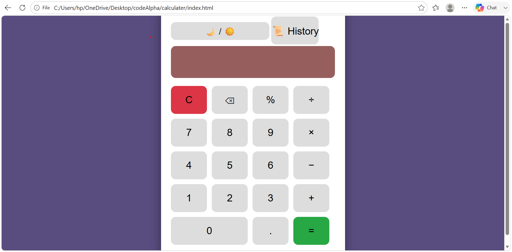
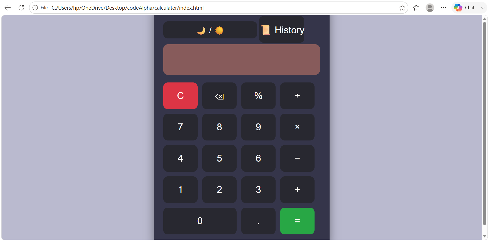
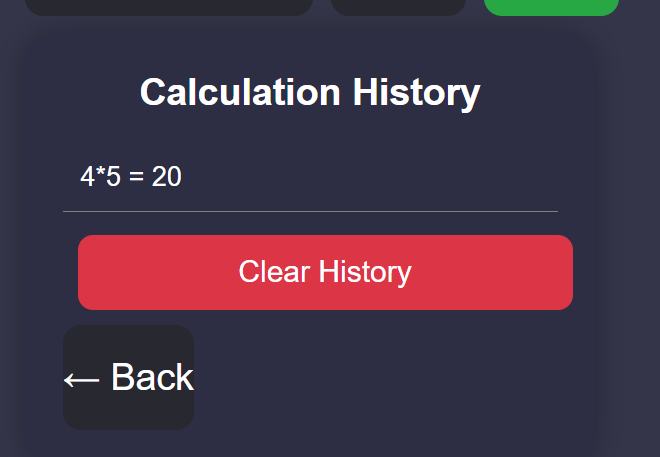

# 🧮 Calculator Web Application

A modern and responsive calculator built using **HTML, CSS, and JavaScript**. It supports all basic arithmetic operations and includes features such as **Dark/Light Mode**, **Calculation History**, **Keyboard Support**, **Percentage Calculation**, **Mobile Responsiveness** and **Local Storage** for an enhanced user experience.

---

## 🌟 Features

* ➕ Addition
* ➖ Subtraction
* ✖️ Multiplication
* ➗ Division
* 📊 Percentage (%) calculation
* 🗑️ Clear display (AC)
* ⌫ Delete last character (DEL)
* 📝 Calculation history

  * Stores previous calculations
  * View previous results
* 🌙 Dark / ☀️ Light theme
* 📱 Responsive design for desktop and mobile
* ✨ Smooth button hover and click animations
* 🎨 Modern and user-friendly interface
* ⌨️ Keyboard support
* 💾 Save calculation history using Local Storage

---

## 🛠️ Technologies Used

* **HTML5** – Structure of the application
* **CSS3** – Styling, responsive layout, themes, and animations
* **JavaScript (ES6)** – Calculator logic and interactivity

---

## 📂 Project Structure

```text
CodeAlpha_Calculator/
│
├── image/
│   ├── light_mode_calculator.png
│   ├── dark_mode_calculator.png
│   └── history_calculator.png
│
├── index.html
├── style.css
├── script.js
└── README.md
```

---

## 🚀 Getting Started

### 1. Clone the repository

```bash
git clone https://github.com/Edldev12/CodeAlpha_Calculator.git
```

### 2. Navigate to the project folder

```bash
cd CodeAlpha_Calculator
```

### 3. Run the application

Open **index.html** in your favorite web browser.

No installation or additional dependencies are required.

---
## 📸 Screenshots

### ☀️ Light Mode



### 🌙 Dark Mode



### 📝 History Panel



---

## 🎯 Future Improvements
* 🧪 Scientific calculator functions
* 📋 Copy result to clipboard
* 🧠 Memory functions (M+, M-, MR, MC)
* ♿ Improve accessibility
* 🎨 Additional color themes

---

## 💡 What I Learned

During this project, I improved my skills in:

* HTML page structure
* CSS Flexbox and responsive design
* JavaScript DOM manipulation
* Event handling
* Theme switching (Dark/Light Mode)
* Managing application state
* Building interactive user interfaces
* Writing clean and organized code

---

## 🤝 Contributing

Contributions, suggestions, and improvements are welcome.

1. Fork this repository.
2. Create a new feature branch.
3. Commit your changes.
4. Push to your branch.
5. Open a Pull Request.

---

## 👨‍💻 Author

**Edlawit Tsegaye**

Software Engineering Student
GitHub: [Edldev12](https://github.com/Edldev12)

---

## 📄 License

This project is licensed under the **MIT License**.

You are free to use, modify, and distribute this project for educational and personal purposes.

---

⭐ If you found this project helpful, consider giving it a **star** on GitHub!
